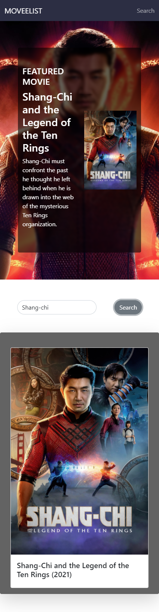

# Dicoding FrontEnd Web Development Submission

This is a solution to the [Belajar Fundamental Front-End Web Development](https://www.dicoding.com/academies/163).
Dicoding is technology education platform I enrol as a scholarship program from Indosat Ooredo. For information about dicoding, please visit [Dicoding](https://www.dicoding.com/)

## Table of contents

- [Overview](#overview)
  - [The challenge](#the-challenge)
  - [Screenshot](#screenshot)
  - [Links](#links)
- [My process](#my-process)
  - [Built with](#built-with)
- [Author](#author)

## Overview
  This website is by far my first website using many of frontend element. What I mean is using of webpack, AJAX, NPM, with ES6, and Custom Element.
  What it do is showing a Featured Movie and Search Movie by title. Powered by [TMDB](https://www.themoviedb.org/) as the source of the movie. It is needed of improvement at the HTML Docs, Styling, and efficiency of Script. I am not intended to fix it, because it will be my starting Milestone.
  
### The challenge

The Challenges I faced is utilizing the webkit, custom element, and Mobile First workflow that I did not know of at that moment.

### Screenshot

  

  

### Links

- Solution URL: [Repository](https://github.com/amuhaemin/moveeList)
- Live Site URL: [my github.io](https://amuhaemin.github.io/moveeList/)

## My process

### Built with

- Semantic HTML5 markup
- Bootstrap v5
- Flexbox
- ES6
- AJAX
- JS Custom Element
- NPM
- WebPack

## Author

- Frontend Mentor - [@amuhaemin](https://www.frontendmentor.io/profile/amuhaemin)
- Instagram - [@amuhaemin](https://www.instagram.com/amuhaemin)
